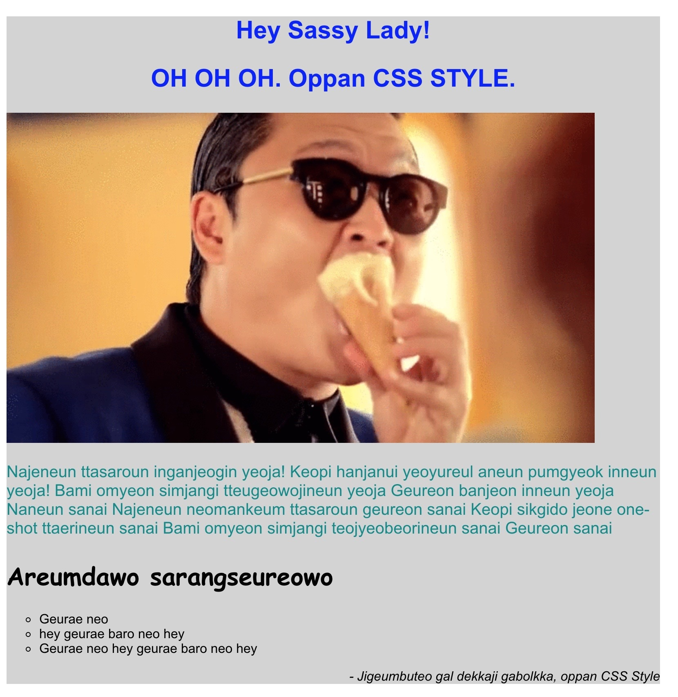
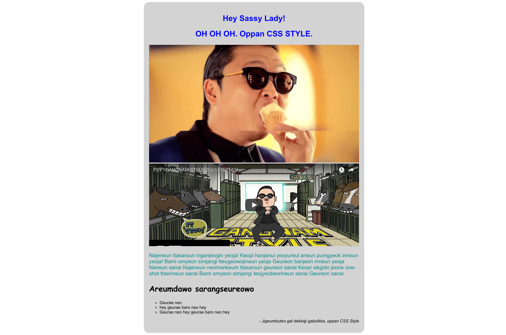

# Oppan CSS Style

Heeeeeeey, sassy lady! In this exercise you will get more experience styling HTML content using CSS. Become a worldwide sensation after perfecting your CSS skills to the max. You will be given and very bland and boring HTML page and will need to spruce it up. 

## Instructions

* First, create a link to the external stylesheet
* Change the font for the entire page by targeting the `body`
    * eg. Arial, Helvetica, Georgia, Comic Sans (please don't...)
* Give the section a unique ID and give it the following properties:
    * a `width` of 800px
    * a `background-color` that is light gray
* Center the `h1` headings, change their color to blue, make them bold and increase the font size
* Insert an image of Psy (You can find them on Google)
* Change the color and font size of the first paragraph **and only this paragraph**
* Change the `h2` heading to a different font, make it bold, and increase its font size to 30px
* Change the list bullet styles so that they are an open circle
* Italicize the last paragraph and align it to the right

When all is said and done, you should have something that looks like this -

**Daebak** that means awesome in Korean.

## Bonus 

Let's spice it up even more. Make it really *gangnam style*...

* Give the section some padding and rounded corners
* Align the section so that it is centered horizontally on the page **you cannot use** `text-align: center` 
* Find the youtube video for `Gangnam Style` and embed it under the image
* Create a class called `center` that will center align both the image and video. Again **you cannot use** `text-align: center`
  
If you've managed to tackle the bonus challenges your page will now look something like this -

Even more **daebak**
