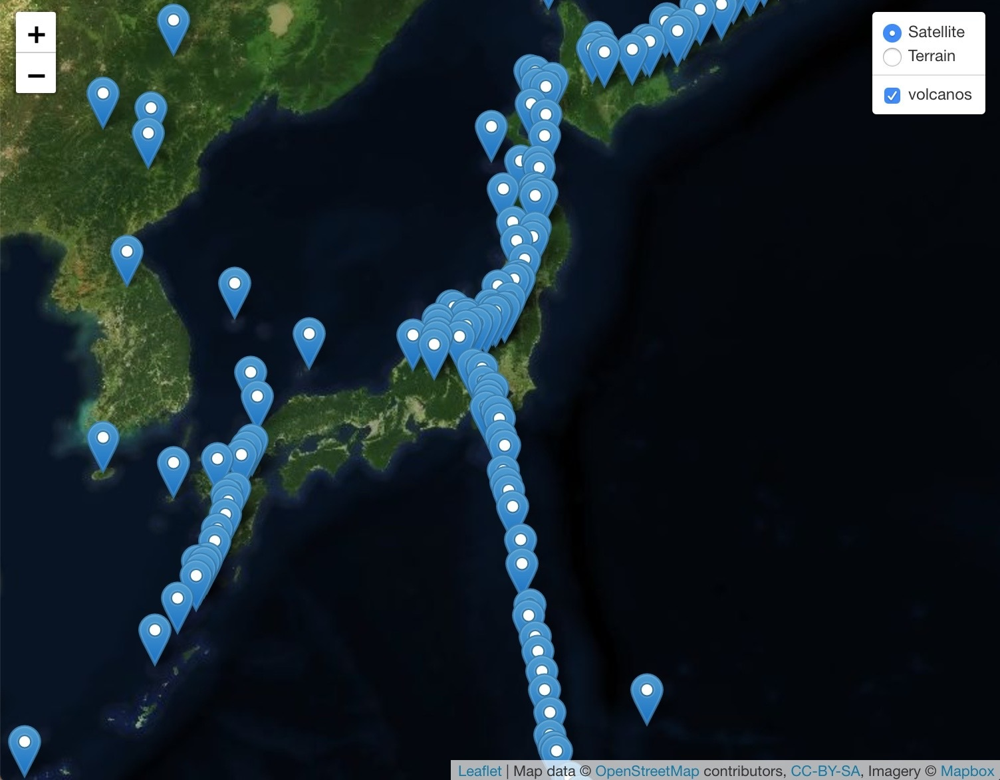

# Explosive Activity

There are over 1500 potential active volcanoes around the world and thousands more that lay dormant. A majority of these volcanoes line the Pacific Rim and is infamously known as the __RING OF FIRE_ :fire: :fire: THE RING OF FIRE!! Sharkbait oo! ha! ha!

## Instructions

Given a [GEOJSON dataset](https://data.humdata.org/dataset/a60ac839-920d-435a-bf7d-25855602699d/resource/7234d067-2d74-449a-9c61-22ae6d98d928/download/volcano.json), use Leaflet.js and Mapbox API to generate a map that marks all the locations of currently known volcanoes. 

The map should...
* have markers with binded popups for each volcano that show's the volcano's name as well as its VEI (Volcanic Explosivity Index)
* have 2 map layers, satellite and terrain. Or feel free to get creative and choose your own map layers
* display the area around Tokyo, Japan on page load

Your finished map should look something like this

